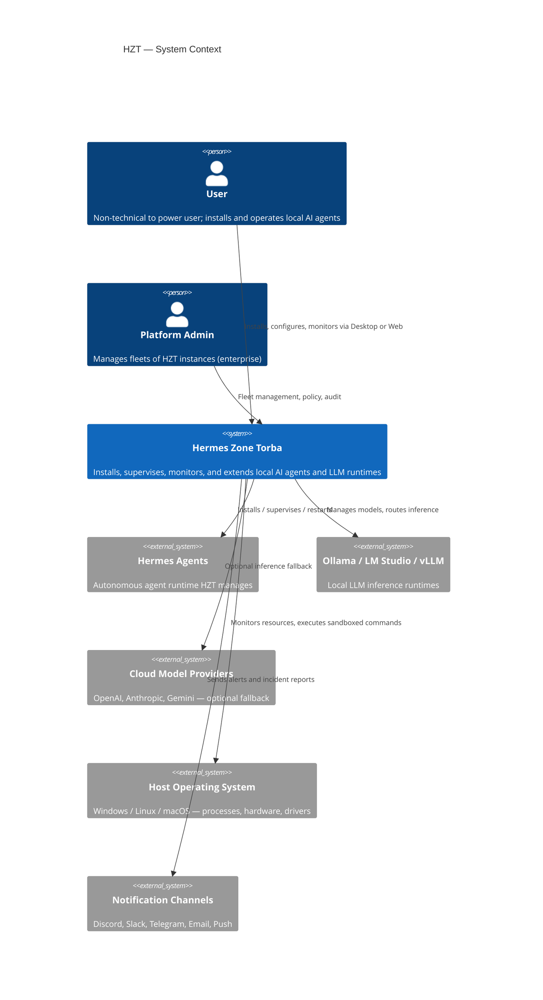
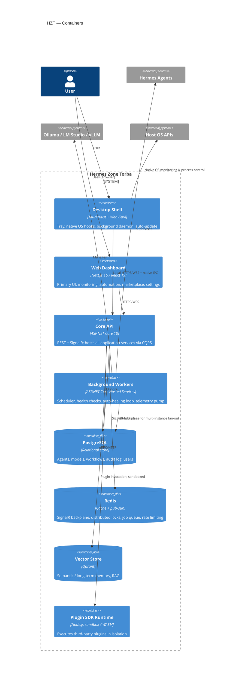
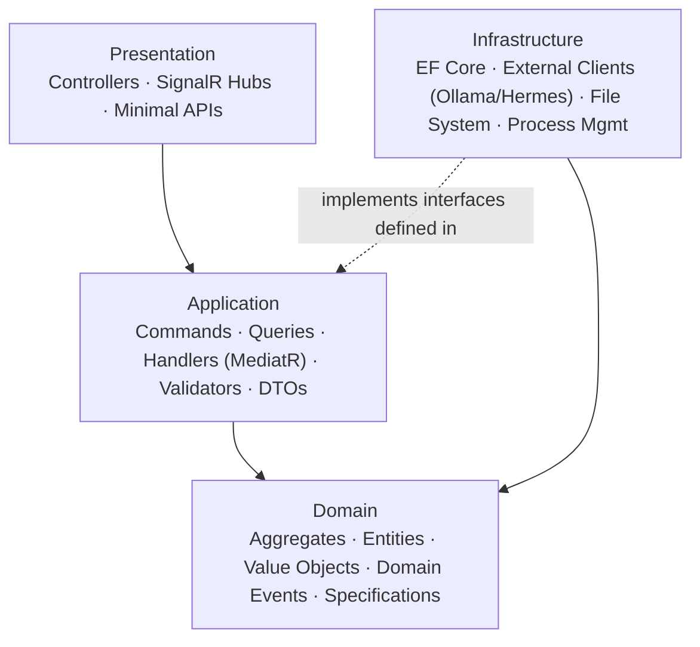

# Architecture Overview

This is the top-level architecture map for Hermes Zone Torba. It exists so a new engineer can understand the
whole system in ten minutes; each subsystem then has its own deep-dive in [`docs/`](docs/).

## C4: System Context

## C4: Containers

## Layered view (per service)

Every backend module follows the same Clean Architecture layering — see
[docs/01-system-architecture.md](docs/01-system-architecture.md#layering) and
[docs/03-domain-model.md](docs/03-domain-model.md) for the full rationale and bounded-context breakdown.

**Dependency rule:** Domain has zero outward dependencies. Application depends only on Domain. Infrastructure
depends on Application's interfaces (never the reverse — no `Infrastructure` reference from `Application` or
`Domain`). Presentation composes everything at the edge. Enforced by architecture tests — see
[docs/16-testing.md](docs/16-testing.md#architecture-tests).

## Cross-cutting concerns

| Concern | Mechanism | Doc |
|---|---|---|
| Authn/Authz | JWT + refresh tokens, RBAC/ABAC | [docs/11-security.md](docs/11-security.md) |
| Supervision | AI Supervisor watches every managed process | [docs/05-ai-supervisor.md](docs/05-ai-supervisor.md) |
| Self-repair | Auto-Healing Engine, policy-driven | [docs/09-auto-healing.md](docs/09-auto-healing.md) |
| Extensibility | Plugin manifest + sandboxed runtime | [docs/10-plugin-system.md](docs/10-plugin-system.md) |
| Observability | OpenTelemetry + Serilog + health checks | [docs/16-testing.md](docs/16-testing.md), [docs/17-deployment.md](docs/17-deployment.md) |
| Real-time updates | SignalR hubs backed by Redis | [docs/04-api-spec.md](docs/04-api-spec.md#realtime-signalr) |

## Where to go next

- Building a new backend module → [docs/03-domain-model.md](docs/03-domain-model.md) + [docs/15-coding-standards.md](docs/15-coding-standards.md)
- Understanding how Hermes/Ollama get installed and supervised → [docs/06-hermes-integration.md](docs/06-hermes-integration.md), [docs/07-local-llm.md](docs/07-local-llm.md)
- Understanding failure recovery → [docs/05-ai-supervisor.md](docs/05-ai-supervisor.md), [docs/09-auto-healing.md](docs/09-auto-healing.md)
- Writing a plugin → [docs/10-plugin-system.md](docs/10-plugin-system.md), [sdk/](sdk/)
- Decisions and their trade-offs → [docs/adr/](docs/adr/)
