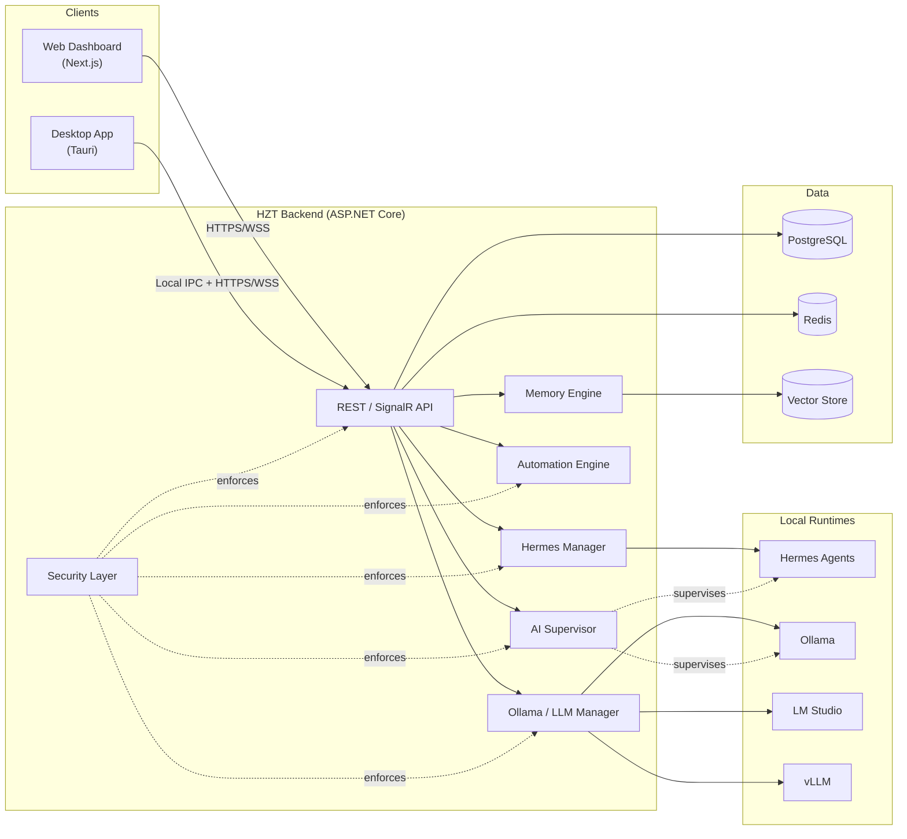

# Hermes Zone Torba (HZT)

**The Operating System for Autonomous AI Agents.**

[](LICENSE)
[](.github/workflows/backend-ci.yml)
[](.github/workflows/frontend-ci.yml)
[](docs/00-project-vision.md)

Hermes Zone Torba is a **local-first platform** that installs, configures, supervises, monitors, and extends
[Hermes AI Agents](docs/06-hermes-integration.md) and local LLM runtimes (Ollama, LM Studio, vLLM). It replaces
terminal-driven setup — installing runtimes, pulling models, editing config files, babysitting processes — with a
single Desktop + Web dashboard that is secure, observable, and extensible by design.

> Non-technical users get one-click AI automation. Advanced users get an open, inspectable, enterprise-grade
> platform underneath it — full API access, a plugin SDK, and a supervised multi-agent runtime.

---

## Why HZT exists

Running local AI well today means juggling five or six separate tools by hand: a runtime (Ollama/LM Studio), model
files, an agent framework, a process supervisor, a monitoring stack, and ad-hoc scripts to glue them together. Each
one fails independently, and when they do, the failure surfaces as a cryptic terminal error. HZT collapses that
stack into one supervised system with a UI, an API, and a recovery model — see
[docs/00-project-vision.md](docs/00-project-vision.md) for the full problem statement and design principles.

## Architecture at a glance



Full breakdown: [docs/01-system-architecture.md](docs/01-system-architecture.md).

## Monorepo layout

| Path | Purpose |
|---|---|
| [`backend/`](backend/) | ASP.NET Core 10 API — Clean Architecture, DDD, CQRS (MediatR), EF Core, SignalR |
| [`frontend/`](frontend/) | Next.js 16 / React 19 web dashboard |
| [`desktop/`](desktop/) | Tauri desktop shell — tray, native OS integration, background daemon |
| [`core/`](core/) | Cross-runtime agent protocol, message schemas, shared runtime contracts |
| [`agents/`](agents/) | Built-in agent implementations (Terminal, File, Browser, IDE, Git, Docker, Notification) |
| [`plugins/`](plugins/) | Plugin manifest schema, sandbox runtime, first-party example plugins |
| [`sdk/`](sdk/) | Plugin & integration SDKs (TypeScript, .NET) |
| [`shared/`](shared/) | Shared kernel: DTOs, event contracts, versioned schemas used by every layer |
| [`infrastructure/`](infrastructure/) | Docker, Kubernetes manifests, provisioning |
| [`scripts/`](scripts/) | Dev bootstrap, codegen, release scripts |
| [`docs/`](docs/) | Architecture, domain, security, API, and process documentation |
| [`examples/`](examples/) | End-to-end example workflows and automations |
| [`tests/`](tests/) | Cross-cutting test suites (E2E, contract, load) |

See [docs/02-folder-structure.md](docs/02-folder-structure.md) for the fully annotated tree.

## Documentation

Start with [docs/00-project-vision.md](docs/00-project-vision.md), then:

1. [01 · System Architecture](docs/01-system-architecture.md)
2. [02 · Folder Structure](docs/02-folder-structure.md)
3. [03 · Domain Model (DDD)](docs/03-domain-model.md)
4. [04 · API Specification](docs/04-api-spec.md)
5. [05 · AI Supervisor](docs/05-ai-supervisor.md)
6. [06 · Hermes Integration](docs/06-hermes-integration.md)
7. [07 · Local LLM Infrastructure](docs/07-local-llm.md)
8. [08 · OS Monitor](docs/08-os-monitor.md)
9. [09 · Auto-Healing Engine](docs/09-auto-healing.md)
10. [10 · Plugin System](docs/10-plugin-system.md)
11. [11 · Security](docs/11-security.md)
12. [12 · Database](docs/12-database.md)
13. [13 · Automation & Workflows](docs/13-workflows.md)
14. [14 · Branching Strategy](docs/14-branching-strategy.md)
15. [15 · Coding Standards](docs/15-coding-standards.md)
16. [16 · Testing Strategy](docs/16-testing.md)
17. [17 · Deployment](docs/17-deployment.md)
18. [18 · Roadmap](docs/18-roadmap.md)

Architecture Decision Records live in [`docs/adr/`](docs/adr/).

## Quick start (development)

```bash
git clone https://github.com/Ali-Khamis45/hermes_zome_torba.git
cd hermes_zome_torba
cp .env.example .env

# Bring up Postgres + Redis
docker compose up -d postgres redis

# Backend API (http://localhost:5080, Swagger at /swagger)
cd backend/src/Api/HermesZoneTorba.Api
dotnet ef database update
dotnet run

# Frontend dashboard (http://localhost:3000)
cd frontend
npm install
npm run dev

# Desktop shell
cd desktop
npm install
npm run tauri dev
```

Full guide: [docs/17-deployment.md](docs/17-deployment.md). One-command bootstrap: [`scripts/bootstrap.sh`](scripts/bootstrap.sh).

## Contributing

HZT follows a `main` (protected/release) + `develop` (integration) branching model with short-lived
`feature/*` branches merged via PR. Read [CONTRIBUTING.md](CONTRIBUTING.md) and
[docs/14-branching-strategy.md](docs/14-branching-strategy.md) before opening a PR.

## Project status

HZT is in **Phase 0 — Architecture & Foundation** (see [docs/18-roadmap.md](docs/18-roadmap.md)). The domain
model, API contracts, and module boundaries below are the working blueprint the team is implementing against;
expect them to evolve through ADRs as Phase 1 lands.

## License

Licensed under the [Apache License 2.0](LICENSE).
