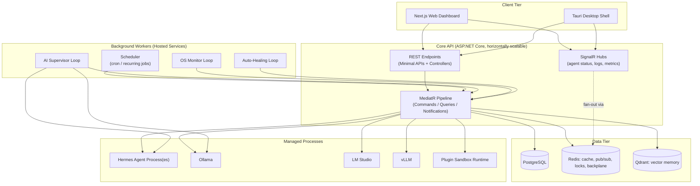
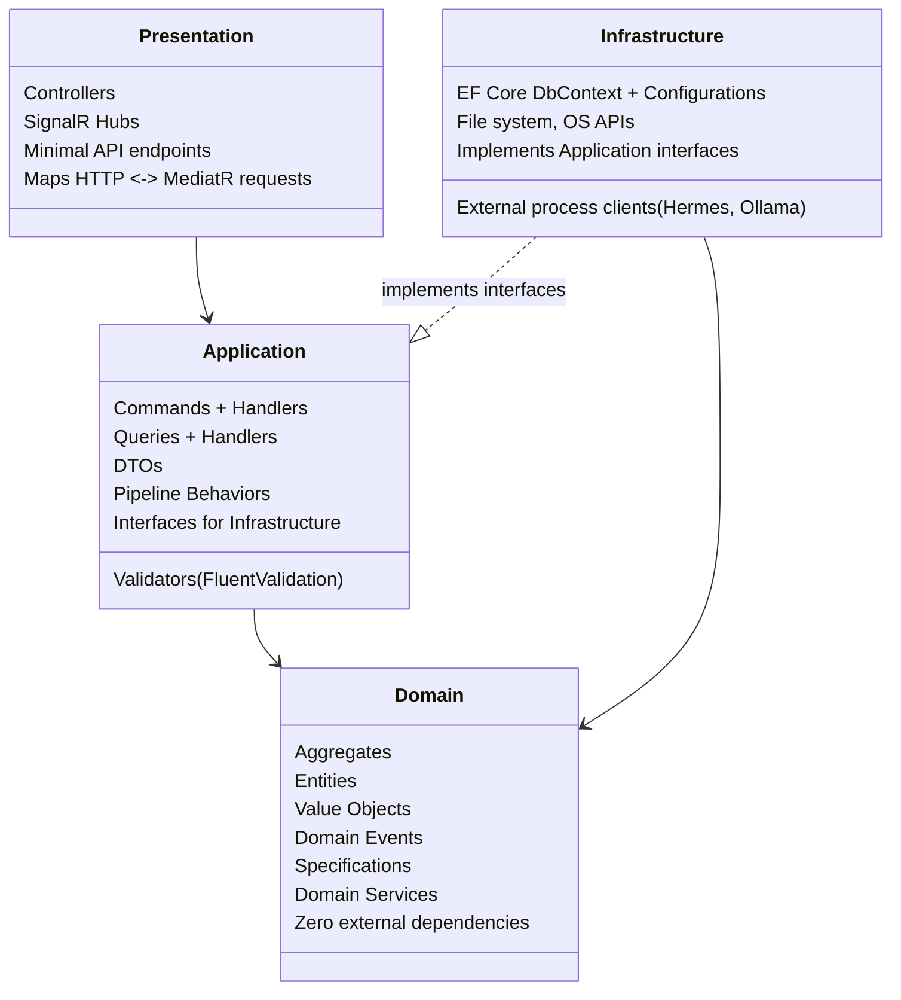
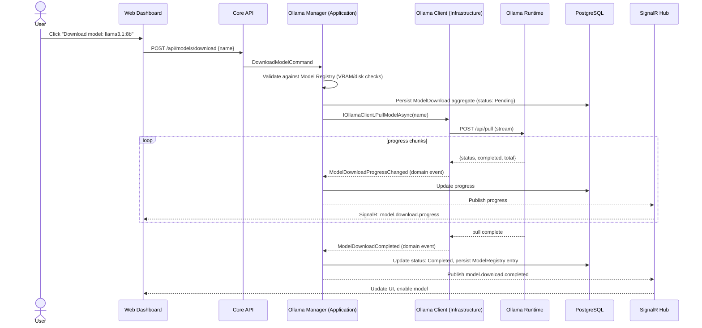
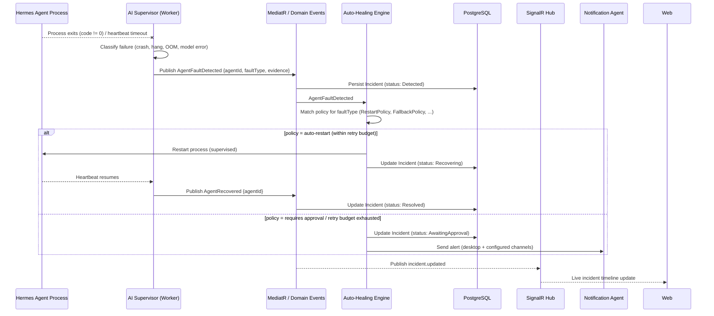

# 01 · System Architecture

## Purpose

The authoritative description of how HZT's containers, layers, and processes fit together — the document to
read before touching cross-module code. Subsystem docs (05–13) assume this as background and don't repeat it.

## Responsibilities

- Define the container topology (what deploys as what, and how they talk).
- Define the layering rules every backend module must follow.
- Define the primary data flows and event flows that cross module boundaries.
- Provide the sequence diagrams for the flows that touch the most subsystems, so nobody has to reconstruct
  them from code.

## Container topology

See [ARCHITECTURE.md](../ARCHITECTURE.md) for the C4 Context and Container diagrams. In short: **Core API**
(ASP.NET Core) is the single source of truth and the only process that talks to PostgreSQL directly. **Web**
and **Desktop** are both clients of the same API — the desktop shell adds native OS integration (tray,
notifications, background daemon) and can also embed the dashboard via a local WebView pointed at the API's
own bundled web build for fully offline operation.

## Layering

Every bounded context in `backend/src/Core` and `backend/src/Infrastructure` follows the same four layers.
This is enforced by NetArchTest-based architecture tests (see [docs/16-testing.md](16-testing.md#architecture-tests)),
not just convention.

**Rules:**

1. `Domain` references nothing outside itself (no EF Core, no ASP.NET Core, no third-party SDKs). It is pure
   C#.
2. `Application` references `Domain` only. It defines interfaces (`IHermesInstallerService`,
   `IApplicationDbContext`, …) that `Infrastructure` implements — dependency inversion, not dependency
   avoidance.
3. `Infrastructure` references `Application` (to implement its interfaces) and `Domain` (to persist/hydrate
   aggregates). It never references `Presentation`.
4. `Presentation` (the `Api` project) composes everything via DI at startup and translates HTTP/SignalR
   to/from MediatR requests. It contains no business logic.
5. Cross-module communication inside the backend happens through **MediatR notifications (domain events)**,
   never direct references between one bounded context's Application layer and another's.

## Data flow: model download

## Event flow: agent crash recovery

This is the flow that most exercises the supervision/healing architecture — see
[docs/05-ai-supervisor.md](05-ai-supervisor.md) and [docs/09-auto-healing.md](09-auto-healing.md) for the
full state machines behind each step.

## Deployment views

HZT supports three deployment shapes; the container topology above is identical in all three, only the
process boundaries change. See [docs/17-deployment.md](17-deployment.md) for concrete manifests.

| Shape | Client | API | Data tier | Use case |
|---|---|---|---|---|
| **Desktop-embedded** | Tauri app | Same process tree, spawned as a local child process | SQLite-compatible mode via EF Core provider swap, or local Postgres container | Single-user local install (default) |
| **Docker Compose** | Browser → Web container | `api` container | `postgres` + `redis` + `qdrant` containers | Power users, small teams, self-hosted |
| **Kubernetes** | Browser / Desktop pointed at cluster | `api` Deployment, horizontally scaled | Managed Postgres + Redis + vector DB | Enterprise fleet, Phase 4 |

## Related documents

- [ARCHITECTURE.md](../ARCHITECTURE.md) — C4 diagrams, one-page map
- [docs/03-domain-model.md](03-domain-model.md) — bounded contexts and aggregates referenced above
- [docs/04-api-spec.md](04-api-spec.md) — concrete endpoint/event contracts for the flows above
- [docs/adr/0002-clean-architecture-ddd-cqrs.md](adr/0002-clean-architecture-ddd-cqrs.md) — why this layering was chosen
