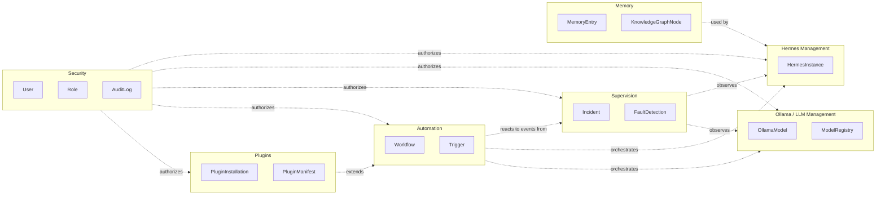
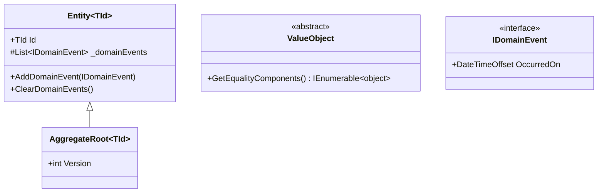
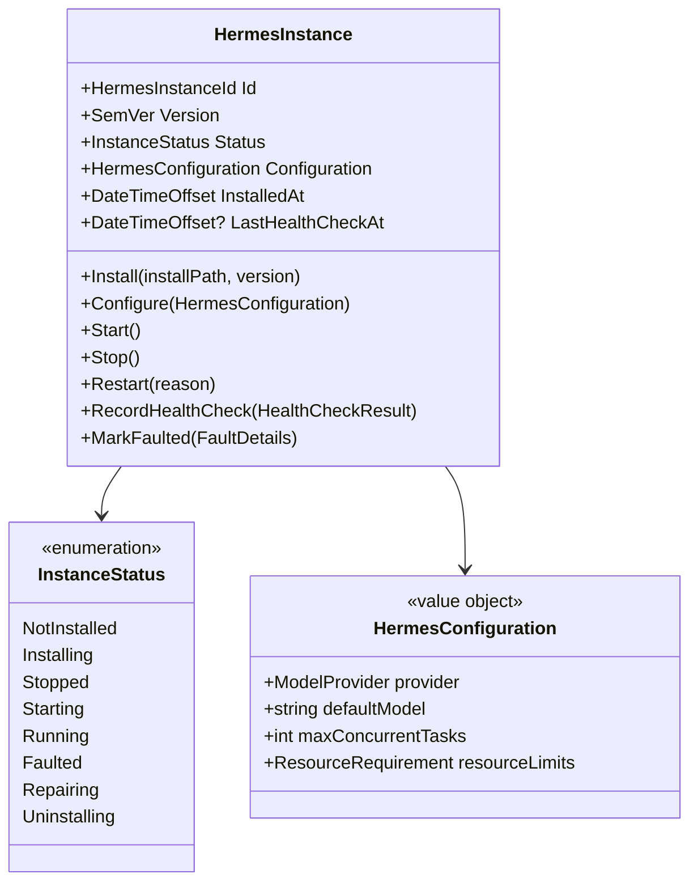
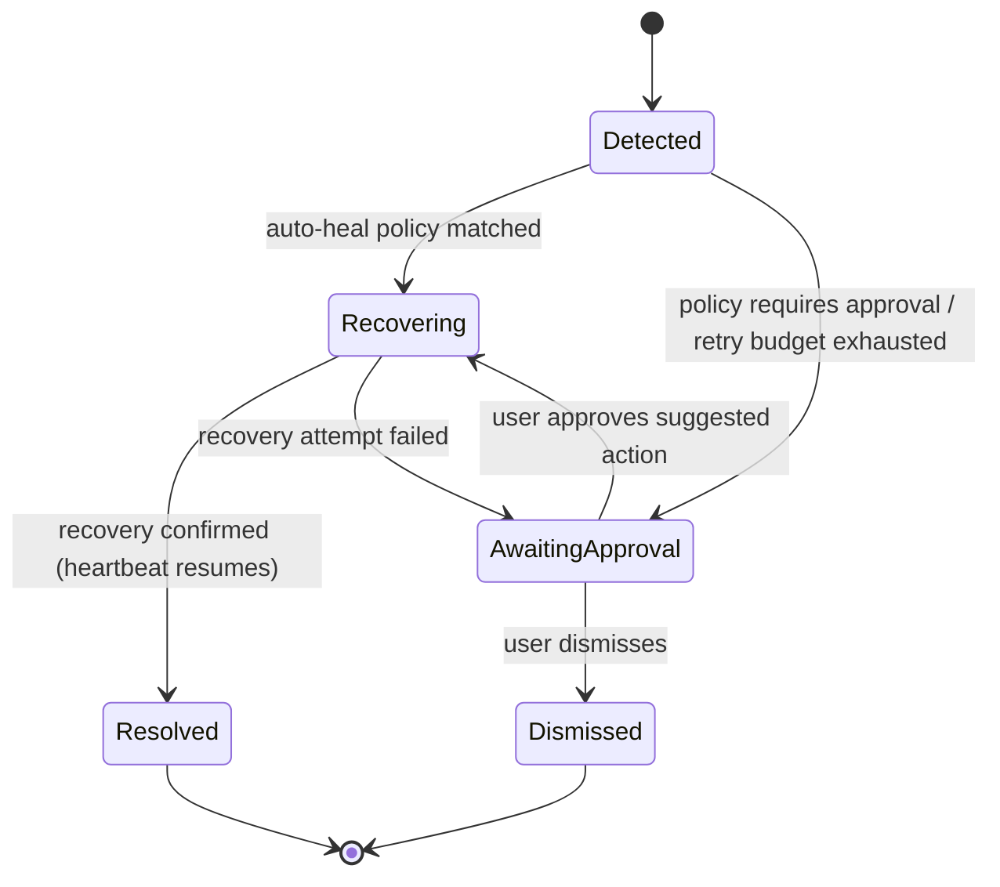

# 03 · Domain Model (DDD)

## Purpose

The domain-driven design backbone: bounded contexts, their aggregates, entities, value objects, domain
events, and the invariants each aggregate protects. This is what `backend/src/Core/HermesZoneTorba.Domain`
implements — read this before adding or changing an aggregate.

## Bounded contexts

Each bounded context owns its own aggregates and is the only context allowed to mutate them. Cross-context
communication happens exclusively through **domain events** dispatched via MediatR notifications — no
bounded context calls into another's repositories or command handlers directly. This keeps contexts
independently deployable if HZT ever splits into services (see [docs/adr/0002-clean-architecture-ddd-cqrs.md](adr/0002-clean-architecture-ddd-cqrs.md)).

| Context | Owns | Reacts to |
|---|---|---|
| Hermes Management | `HermesInstance` lifecycle | `IncidentResolved` (restart confirmation) |
| Ollama / LLM Management | `OllamaModel`, `ModelRegistry`, `ProviderConfiguration` | `DiskSpaceCritical` (from OS Monitor) |
| Supervision | `Incident`, `FaultDetection` | `HeartbeatMissed`, `ProcessExited`, any managed-process signal |
| Automation | `Workflow`, `Trigger`, `Schedule` | `Incident*`, `OsMetricThresholdCrossed`, any published domain event a trigger subscribes to |
| Security | `User`, `Role`, `Permission`, `AuditLog` | Every command (cross-cutting authorization + audit) |
| Plugins | `PluginInstallation`, `PluginManifest` | `PluginHealthCheckFailed` |
| Memory | `MemoryEntry`, `KnowledgeGraphNode` | `ConversationCompleted`, explicit "remember this" commands |

## Shared kernel

`Domain/Common` — used by every bounded context, changed rarely and only with cross-team review:

Value objects used across contexts: `ResourceRequirement` (RAM/VRAM/disk), `SemVer`, `HardwareProfile`,
`Percentage`, `Money` (reserved for future marketplace billing).

## Hermes Management

**Aggregate root: `HermesInstance`**

**Invariants:** a `HermesInstance` cannot transition `Start()` unless `Status ∈ {Stopped, Faulted}` and its
`HermesConfiguration` has passed validation (a `ModelProvider` that resolves to an installed, running
provider). `Restart()` always goes through `Stop()` → `Start()` and is idempotent if already stopped.

**Domain events:** `HermesInstallStarted`, `HermesInstallCompleted`, `HermesInstallFailed`,
`HermesConfigurationChanged`, `HermesStarted`, `HermesStopped`, `HermesFaulted`, `HermesRepaired`.

## Ollama / LLM Management

**Aggregate root: `OllamaModel`** (one per pulled model on a given provider instance); **Aggregate root:
`ModelRegistry`** (the catalog of known models and their metadata, independent of what's actually pulled
locally — see [docs/07-local-llm.md](07-local-llm.md) for the full attribute list: RAM/VRAM requirements,
quantization, context length, benchmark results, hardware compatibility).

**Invariants:** a model cannot be marked `Active` (routable for inference) unless its `ResourceRequirement`
fits the last-known `HardwareProfile` reported by the OS Monitor, and exactly one model per
`(provider, role)` pair can be the default for that role (e.g., one default chat model, one default embedding
model).

**Domain events:** `ModelDownloadStarted`, `ModelDownloadProgressChanged`, `ModelDownloadCompleted`,
`ModelDownloadFailed`, `ModelDeleted`, `ModelActivated`, `ModelBenchmarkCompleted`.

## Supervision

**Aggregate root: `Incident`** — created the moment a `FaultDetection` crosses the threshold that promotes it
from "noise" to "something a human or the healing engine must act on." See
[docs/05-ai-supervisor.md](05-ai-supervisor.md) for the full fault-classification state machine.

**Invariants:** an `Incident` always references the `AggregateId` and context of the thing that faulted; it
cannot be `Resolved` without a `ResolutionRecord` (what action was taken, by whom/what policy, and the
evidence that recovery succeeded) — this is what powers the generated incident report.

**Domain events:** `AgentFaultDetected`, `IncidentEscalated`, `IncidentAutoRecovered`, `IncidentResolved`,
`IncidentDismissed`.

## Automation

**Aggregate root: `Workflow`** — a graph of `Trigger → Condition[] → Action[]`, versioned, with an execution
history. See [docs/13-workflows.md](13-workflows.md) for the trigger/condition/action taxonomy and the visual
builder's serialization format.

**Invariants:** a `Workflow` must have at least one `Trigger` and at least one `Action` to be `Enabled`; a
`Trigger` referencing a domain event type that no longer exists (e.g., after a plugin uninstall) is
auto-disabled with a surfaced warning, never silently dropped.

**Domain events:** `WorkflowCreated`, `WorkflowEnabled`, `WorkflowDisabled`, `WorkflowExecutionStarted`,
`WorkflowExecutionCompleted`, `WorkflowExecutionFailed`.

## Security

**Aggregates: `User`, `Role`, `AuditLog`** — see [docs/11-security.md](11-security.md) for the full RBAC/ABAC
model, permission catalog, and audit event schema. Every command handler in every other context depends on
`ICurrentUser` (an Application-layer interface Security's Infrastructure implements) rather than reaching into
the Security aggregates directly — this is the one context every other context is allowed to depend on
*through an interface*, never through its concrete types.

## Plugins

**Aggregate root: `PluginInstallation`** — tracks a plugin's manifest, granted permissions (a subset of what
it requested, per user approval), version, and health. See [docs/10-plugin-system.md](10-plugin-system.md).

**Invariants:** a `PluginInstallation` cannot reach `Enabled` status without an explicit `PermissionGrant` for
every permission its manifest's `required` list declares; optional permissions default to denied.

## Memory

**Aggregates: `MemoryEntry`** (a fact, preference, or piece of context, with an embedding reference into the
vector store) and **`KnowledgeGraphNode`** (typed relationships between entries, projects, and files). See
[docs/13-workflows.md](13-workflows.md) and the RAG section of [docs/07-local-llm.md](07-local-llm.md).

## Specifications and policies

Reusable query predicates and business rules are expressed as `Specification<T>` objects (e.g.,
`ModelFitsHardwareSpecification`, `IncidentRequiresApprovalSpecification`) rather than inlined LINQ scattered
across handlers — this keeps invariants testable in isolation and reusable between command validation and
query filtering. Healing/automation decisions that are explicitly meant to be user-tunable are expressed as
**Policies** (e.g., `RestartPolicy`, `FallbackPolicy`) — data-driven, stored, editable from the dashboard,
distinct from hard invariants which are never user-editable.

## Related documents

- [docs/12-database.md](12-database.md) — how each aggregate maps to PostgreSQL tables
- [docs/04-api-spec.md](04-api-spec.md) — commands/queries exposed per context
- [docs/15-coding-standards.md](15-coding-standards.md#ddd-conventions) — naming and implementation conventions
