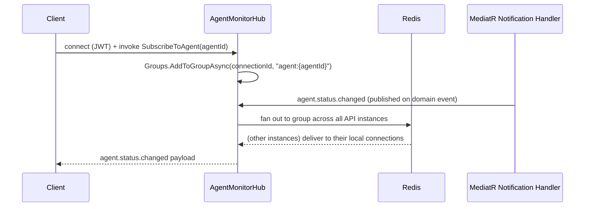

# 04 · API Specification

## Purpose

The contract between clients (Web, Desktop, third-party SDKs) and the Core API. The generated OpenAPI document
(served at `/swagger/v1/swagger.json` in every environment, UI at `/swagger`) is the machine-readable source
of truth; this document explains the conventions that make it consistent and how real-time events complement
the REST surface.

## Conventions

- **Base path:** `/api/v1`. Version is in the URL path, not a header — see [Versioning](#versioning).
- **Format:** JSON, `camelCase` properties, ISO-8601 timestamps in UTC.
- **Errors:** [RFC 9457 Problem Details](https://www.rfc-editor.org/rfc/rfc9457) for every non-2xx response:

```json
{
  "type": "https://docs.hzt.dev/errors/model-download-conflict",
  "title": "Model download already in progress",
  "status": 409,
  "detail": "Model 'llama3.1:8b' is already downloading (progress: 42%).",
  "instance": "/api/v1/models/downloads/7f1e...",
  "traceId": "00-4bf9...-01"
}
```

- **Pagination:** cursor-based on all list endpoints — `?cursor=<opaque>&limit=50` (default 20, max 200),
  response envelope:

```json
{ "items": [ /* ... */ ], "nextCursor": "eyJ...", "hasMore": true }
```

- **Filtering/sorting:** `?filter[status]=Running&sort=-createdAt` (RSQL-lite; `-` prefix = descending).
- **Idempotency:** all `POST` endpoints that trigger a side effect (install, download, restart) accept an
  `Idempotency-Key` header; replays within 24h return the original result instead of re-executing.
- **Correlation:** every request/response pair carries `traceId` (W3C Trace Context), propagated through
  MediatR behaviors into logs and OpenTelemetry spans.

## Authentication & authorization

`Authorization: Bearer <JWT>`. Access tokens are short-lived (15 min default); refresh via
`POST /api/v1/auth/refresh` with the rotating refresh token stored as an HttpOnly cookie (web) or OS keychain
(desktop). Full model in [docs/11-security.md](11-security.md).

| Endpoint | Auth |
|---|---|
| `POST /api/v1/auth/login`, `/auth/refresh` | Anonymous |
| Everything else | Bearer token required |
| Mutating endpoints under `/security/*`, `/plugins/*/permissions` | Bearer token + `admin` role or explicit permission |

## Representative endpoint groups

Full detail lives in the generated OpenAPI spec; this table is the map, not the whole territory.

| Group | Base path | Examples |
|---|---|---|
| Hermes Management | `/api/v1/hermes` | `POST /hermes/install`, `POST /hermes/{id}/restart`, `GET /hermes/{id}/status`, `POST /hermes/{id}/repair` |
| Ollama / LLM | `/api/v1/models` | `GET /models`, `POST /models/download`, `DELETE /models/{id}`, `POST /models/{id}/benchmark`, `POST /models/{id}/activate` |
| Providers | `/api/v1/providers` | `GET /providers`, `POST /providers/{id}/test-connection` |
| Supervision | `/api/v1/incidents` | `GET /incidents`, `POST /incidents/{id}/approve`, `POST /incidents/{id}/dismiss` |
| Automation | `/api/v1/workflows` | `GET/POST /workflows`, `POST /workflows/{id}/enable`, `POST /workflows/{id}/run` |
| OS Monitor | `/api/v1/system` | `GET /system/metrics`, `GET /system/processes`, `GET /system/hardware` |
| Memory | `/api/v1/memory` | `GET /memory/entries`, `POST /memory/entries`, `POST /memory/search` (semantic) |
| Plugins | `/api/v1/plugins` | `GET /plugins`, `POST /plugins/install`, `POST /plugins/{id}/permissions` |
| Security | `/api/v1/security` | `GET /security/audit-log`, `GET/POST /security/roles` |
| Terminal Agent | `/api/v1/agents/terminal` | `POST /agents/terminal/execute` (requires approval workflow, see docs/11) |

## Realtime (SignalR)

Hub endpoints under `/hubs`, authenticated the same way as REST (`access_token` query param during the
SignalR handshake, per SignalR convention). Redis backplane fans events out across horizontally scaled API
instances.

| Hub | Path | Server → Client events |
|---|---|---|
| `AgentMonitorHub` | `/hubs/agents` | `agent.status.changed`, `agent.fault.detected`, `incident.updated` |
| `ModelHub` | `/hubs/models` | `model.download.progress`, `model.download.completed`, `model.download.failed` |
| `MetricsHub` | `/hubs/metrics` | `system.metrics.tick` (1s cadence, subscribable per metric group) |
| `LogStreamHub` | `/hubs/logs` | `log.line` (structured, filterable by source on subscribe) |
| `WorkflowHub` | `/hubs/workflows` | `workflow.execution.started/completed/failed`, `workflow.step.completed` |

Clients subscribe by invoking a hub method (e.g., `hub.invoke("SubscribeToAgent", agentId)`) — HZT does not
broadcast every event to every connection; groups are scoped per resource to keep fan-out cheap.



## Streaming (chat / inference passthrough)

`POST /api/v1/inference/chat` supports `Accept: text/event-stream` for token-by-token streaming, proxied from
the active provider (Ollama/LM Studio/vLLM/cloud) through the Provider Abstraction described in
[docs/07-local-llm.md](07-local-llm.md#provider-abstraction) — clients never talk to the underlying runtime
directly, so routing, fallback, and audit logging stay centralized.

## Versioning

- URL path major version (`/api/v1`); breaking changes ship as `/api/v2` with `v1` deprecated on a published
  timeline (minimum 2 minor releases), never removed silently.
- Additive, backward-compatible changes (new optional fields, new endpoints) ship within `v1` and are called
  out in the changelog, not treated as breaking.
- SignalR event payloads are versioned via an `eventVersion` field so long-lived desktop clients can detect
  and adapt to schema changes without a hard break.

## Related documents

- [docs/11-security.md](11-security.md) — auth details, rate limiting, RBAC
- [docs/01-system-architecture.md](01-system-architecture.md) — sequence diagrams these endpoints implement
- [shared/contracts/](../shared/contracts/) — the DTO source of truth OpenAPI generation reads from
