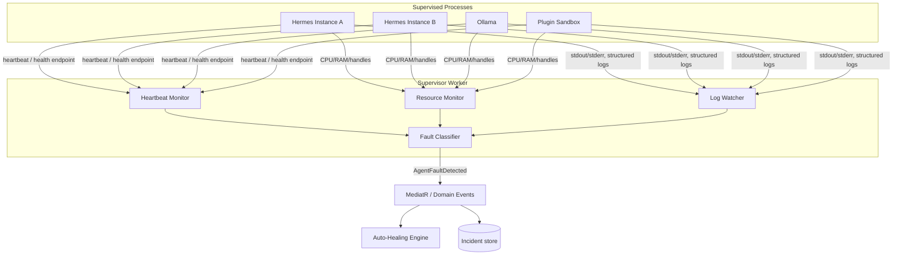
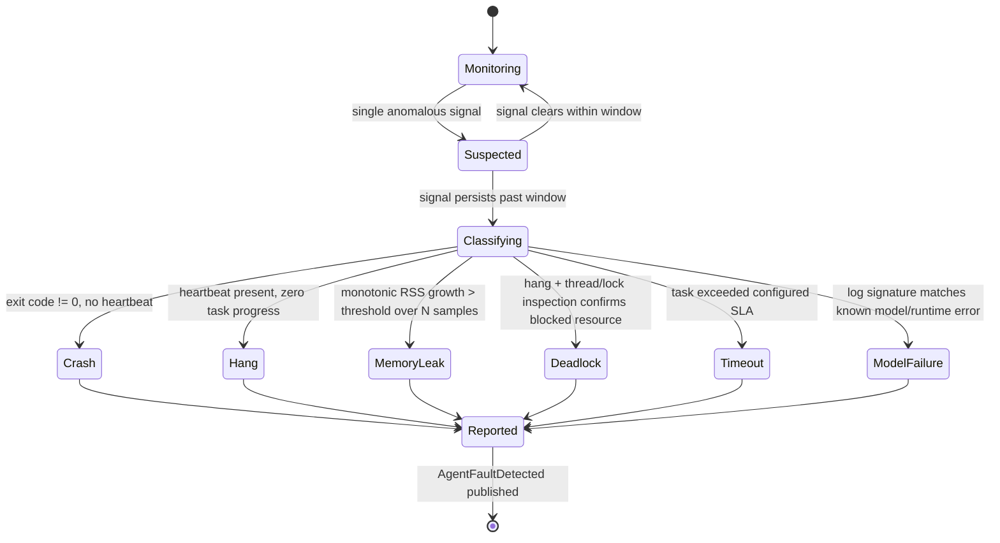

# 05 · AI Supervisor

## Purpose

The AI Supervisor is the background worker that watches every managed process (Hermes instances, LLM
providers, plugin sandboxes) and turns raw failure signals into classified, actionable `Incident`s. It is the
sensor; [Auto-Healing](09-auto-healing.md) is the actuator. This document owns the *detection and
classification* half of that pair.

## Responsibilities

- Maintain a heartbeat/liveness check against every supervised process.
- Classify failures into a fixed taxonomy (crash, hang, memory leak, deadlock, timeout, model failure) using
  signal combinations, not single indicators.
- Create and update `Incident` aggregates (see [docs/03-domain-model.md](03-domain-model.md#supervision)).
- Decide *whether* a fault needs healing/notification — the *how* is delegated to the Auto-Healing Engine.
- Produce the evidence trail an incident report is built from.

## Architecture



## Signal sources

| Signal | Source | Detects |
|---|---|---|
| Heartbeat | Periodic `GET /health` or protocol ping (`core/protocol`) | Crash, hang, unresponsive process |
| Process exit code | OS process handle | Crash (with exit code for classification) |
| Resource trend | [OS Monitor](08-os-monitor.md) feed, sampled per process | Memory leak (monotonic RSS growth), CPU pegged (possible infinite loop) |
| Log pattern | Structured log stream, matched against known error signatures | Model load failure, OOM-kill, driver error |
| Deadlock heuristic | Heartbeat present but zero forward progress on active task queue for > threshold | Deadlock / stuck task |

No single signal creates an `Incident` on its own except a hard crash (nonzero exit + no restart in flight) —
everything else requires signal correlation over a sliding window to avoid false positives from a single slow
tick.

## Fault classification state machine



## Sequence: detection to incident

See [docs/01-system-architecture.md](01-system-architecture.md#event-flow-agent-crash-recovery) for the full
end-to-end diagram from detection through healing and notification. The Supervisor's job ends at
`AgentFaultDetected` — everything downstream (restart, fallback, notify) is Auto-Healing's responsibility.

## Supervisor-to-healing handoff contract

The Supervisor never restarts a process itself — that would collapse detection and remediation into one
component and make both harder to test and tune independently. Instead it publishes a fully-formed evidence
package:

```csharp
public sealed record AgentFaultDetected(
    Guid AggregateId,
    SupervisedProcessType ProcessType,   // HermesInstance, OllamaProvider, PluginSandbox
    FaultType FaultType,                 // Crash, Hang, MemoryLeak, Deadlock, Timeout, ModelFailure
    FaultEvidence Evidence,              // signals that triggered classification, timestamps, samples
    DateTimeOffset OccurredOn
) : IDomainEvent;
```

## Configuration

Per-process-type thresholds are stored as policy data (editable from **Settings → Diagnostics**), not
hardcoded — heartbeat interval, missed-heartbeat threshold, RSS growth window/slope, hang detection window.
Defaults are conservative (favor a late detection over a false positive) and documented inline in
`appsettings.json` under `Supervisor:*`.

## Multi-agent awareness

When multiple Hermes instances collaborate (see the multi-agent roles in the project brief — Planner,
Researcher, Coder, Reviewer, etc.), the Supervisor tracks each instance independently but correlates faults
that occur within the same `WorkflowExecution` — a cascading failure (one agent's crash stalling three
downstream agents) is reported as one root-cause incident with linked effects, not four unrelated incidents.

## Related documents

- [docs/09-auto-healing.md](09-auto-healing.md) — what happens after `AgentFaultDetected`
- [docs/08-os-monitor.md](08-os-monitor.md) — the resource signal source
- [docs/03-domain-model.md](03-domain-model.md#supervision) — the `Incident` aggregate this worker populates
