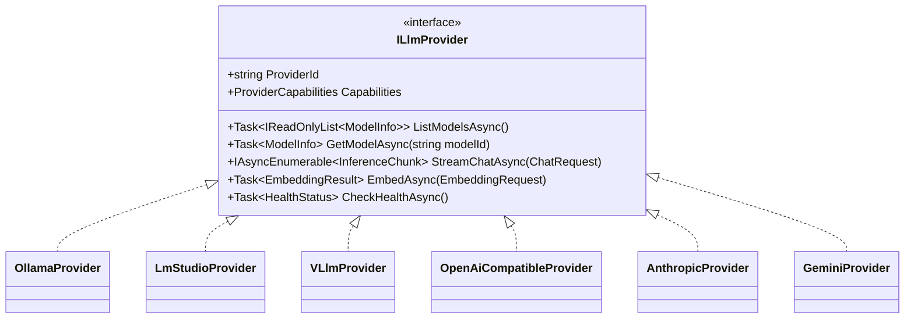
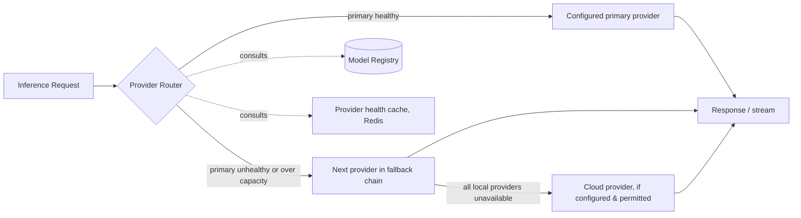

# 07 · Local LLM Infrastructure

## Purpose

How HZT manages LLM runtimes (Ollama, LM Studio, vLLM) and cloud-compatible providers behind one abstraction,
so Hermes instances, the chat/inference API, and the dashboard never need to know which runtime is actually
serving a request.

## Provider abstraction

`ILlmProvider` is defined in the Application layer (`Common/Interfaces`); each concrete provider lives in
`Infrastructure/ExternalServices/`. Adding a new provider never touches Domain or Application beyond
registering it — this is the extension point [docs/adr/0002-clean-architecture-ddd-cqrs.md](adr/0002-clean-architecture-ddd-cqrs.md)
exists to protect.

## Inference routing & fallback

Routing decisions consider: configured preference order, live health (from periodic `CheckHealthAsync`,
cached in Redis with a short TTL to avoid hammering providers), and whether the requested model/capability
(chat, embedding, vision) is actually available on that provider. Fallback to a cloud provider is opt-in per
Hermes instance/workflow — never automatic without explicit configuration, since it has cost and data-
residency implications.

## Model Registry

Tracked per model, independent of whether it's currently pulled (catalog data seeded from a curated manifest,
refreshed periodically; local state layered on top):

| Attribute | Notes |
|---|---|
| Name / Tag | e.g. `llama3.1:8b-instruct-q4_K_M` |
| Version | Upstream model version |
| RAM / VRAM requirements | Minimum and recommended, used for pre-flight checks |
| Disk size | Download size |
| License | Surfaced in UI before download |
| Context length | Tokens |
| Quantization | e.g. Q4_K_M, Q8_0, FP16 |
| Speed | Measured tokens/sec from the last local benchmark, per hardware profile |
| Hardware compatibility | GPU vendor/VRAM tiers this model realistically runs on |
| Recommended usage | chat / code / embedding / vision tag |
| Benchmark results | Latency, throughput, perplexity spot-checks where available |
| Tags | Free-form, used by search/filtering in the dashboard |

## Model lifecycle

Download → validate (checksum + a smoke-test inference call) → register in local catalog → optionally
activate as default for a role. See [docs/01-system-architecture.md](01-system-architecture.md#data-flow-model-download)
for the full download sequence diagram including progress streaming. Deletion frees disk and, if the deleted
model was an active default, prompts the user to pick a replacement rather than silently leaving the role
unset.

## Hardware detection & benchmarking

Hardware detection (CPU, RAM, GPU vendor/VRAM, disk headroom) runs at install time and periodically via the
[OS Monitor](08-os-monitor.md), producing the `HardwareProfile` value object used to pre-flight model
downloads ("this model needs 12GB VRAM, you have 8GB — recommend Q4 quantization instead"). Benchmarking runs
a standardized prompt set against a model on the current hardware and records tokens/sec, time-to-first-token,
and peak memory, stored against `(model, hardwareProfile)` so results are comparable across the fleet in
enterprise deployments.

## RAG / vector memory integration

Embeddings generated through the same `ILlmProvider.EmbedAsync` abstraction are written to the vector store
(Qdrant by default; Chroma/Milvus supported behind the same repository interface) and indexed against
`MemoryEntry` aggregates — see [docs/03-domain-model.md](03-domain-model.md#memory) and
[docs/13-workflows.md](13-workflows.md#memory--rag) for how workflows and agents query it.

## Related documents

- [docs/06-hermes-integration.md](06-hermes-integration.md) — how Hermes instances consume this abstraction
- [docs/09-auto-healing.md](09-auto-healing.md) — GPU driver crash / OOM recovery policies
- [docs/12-database.md](12-database.md) — Model Registry schema
