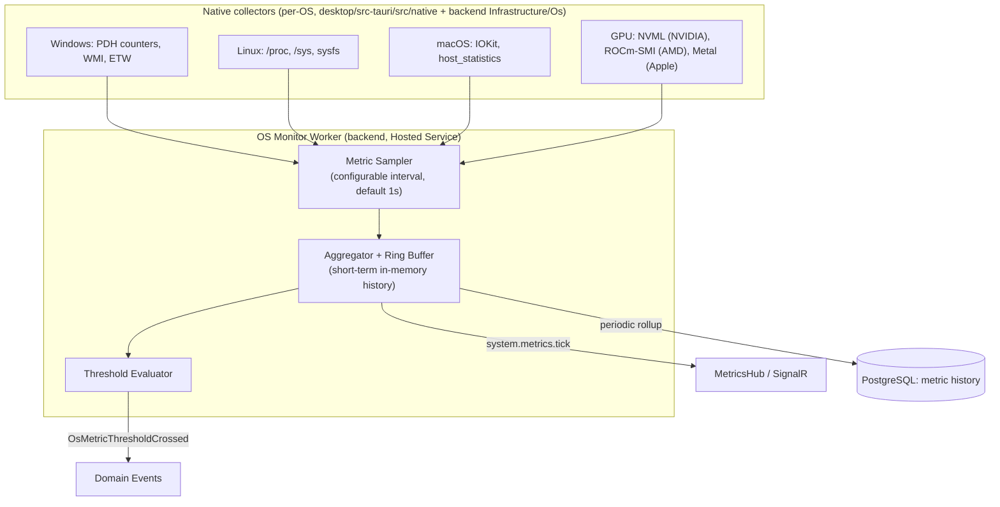

# 08 · OS Monitor

## Purpose

The subsystem that gives HZT eyes on the host machine: CPU, RAM, GPU/VRAM, disk, battery, temperature,
processes, threads, services, network, running applications, GPU drivers, and OS-level events/logs. Every
other subsystem that reacts to machine state — [AI Supervisor](05-ai-supervisor.md),
[Auto-Healing](09-auto-healing.md), [Automation](13-workflows.md) — consumes OS Monitor output; it never reads
hardware state directly itself.

## Architecture

Desktop deployments collect natively via the Tauri shell (lowest overhead, direct OS API access); Docker/
server deployments collect via the backend's `Infrastructure/Os` implementations reading container-visible
`/proc` and `/sys` (with clear UI messaging that containerized visibility is host-namespace-limited unless run
privileged).

## Monitored dimensions

| Dimension | Metrics | Primary consumer |
|---|---|---|
| CPU | Per-core %, aggregate %, frequency, temperature (where exposed) | Auto-Healing (pegged-CPU hang detection), dashboard |
| RAM | Used/available, per-process RSS, swap | Supervisor (memory leak detection), Auto-Healing |
| GPU / VRAM | Utilization %, VRAM used/total, driver version, ECC errors (if applicable) | Local LLM Manager (pre-flight checks), Auto-Healing (driver crash) |
| Disk | Used/free per volume, I/O throughput, SMART health (where accessible) | Auto-Healing (disk-full cleanup) |
| Battery | Charge %, charging state, time remaining | Automation (power-saving triggers) |
| Processes/threads | Per supervised process: handle count, thread count, open files | Supervisor |
| Network | Interface throughput, connectivity to configured provider endpoints | Local LLM Manager fallback routing |
| OS events/logs | Windows Event Log, systemd journal, macOS unified log — filtered to driver/service/crash-relevant entries | Auto-Healing, Diagnostics page |

## Threshold evaluation

Thresholds are policy data (same pattern as [Auto-Healing policies](09-auto-healing.md#policy-model)), not
hardcoded: `metric`, `comparator`, `value`, `sustainedForSeconds` (avoids reacting to single-sample spikes),
`scope` (global / per-process). Crossing a threshold publishes `OsMetricThresholdCrossed`, which both the
Automation Engine (for user-authored triggers like "IF GPU Usage > 95%") and Auto-Healing (for built-in
recovery policies) subscribe to independently — the OS Monitor doesn't know or care who's listening.

## Data retention

Live 1-second-resolution samples live in an in-memory ring buffer (last 5 minutes) for the real-time dashboard
charts; a downsampled rollup (1-minute averages) persists to PostgreSQL with a configurable retention window
(default 30 days) for historical charts and incident forensics — see [docs/12-database.md](12-database.md#metric-history)
for the partitioning strategy that keeps this table from growing unbounded.

## Dashboard surface

The **CPU**, **GPU**, **RAM**, **Disk**, **Network**, and **Processes** dashboard pages are thin clients over
`GET /api/v1/system/metrics` (historical) and the `MetricsHub` SignalR stream (live) — no dashboard-specific
aggregation logic lives in the frontend.

## Related documents

- [docs/09-auto-healing.md](09-auto-healing.md) — the primary consumer of threshold events
- [docs/13-workflows.md](13-workflows.md) — user-defined automation triggers on OS Monitor events
- [docs/12-database.md](12-database.md) — metric history schema and partitioning
