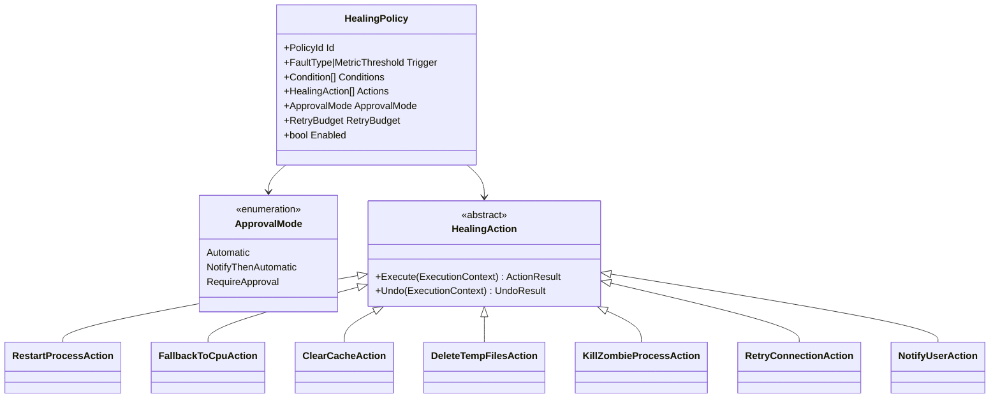
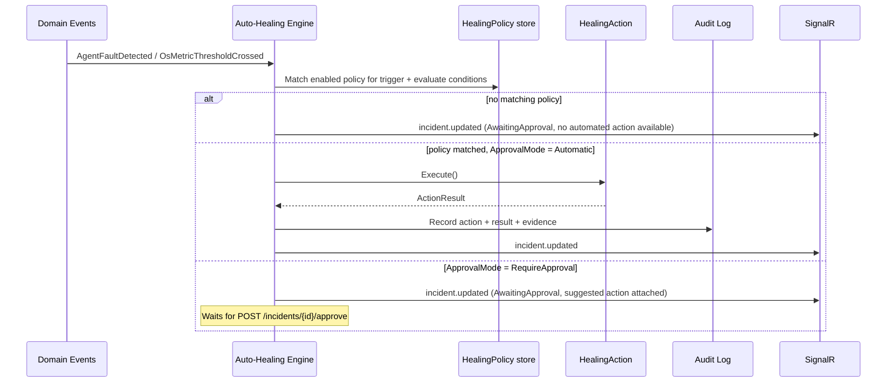

# 09 · Auto-Healing Engine

## Purpose

Turns detected problems — from the [AI Supervisor](05-ai-supervisor.md) or the [OS Monitor](08-os-monitor.md)
— into remediation, within limits the user controls. Detection without action is a dashboard nobody watches at
2am; this document defines the "then what."

## Policy model

Every healing rule is data, not code: `HealingPolicy { trigger, conditions[], actions[], approvalMode,
retryBudget }`, editable from **Settings → Auto-Healing** and versioned like any other configuration. Built-in
policies ship as seed data and can be disabled, not just overridden silently.

Every `HealingAction` implements `Undo` where technically possible (restart doesn't need undo semantics; a
destructive cleanup action needs a dry-run preview instead — see [Guardrails](#guardrails)). Actions without a
meaningful undo (e.g., killing a zombie process) require an explicit `Undo` implementation that documents *why
it's a no-op*, so the gap is a deliberate decision visible in code review, not an oversight.

## Built-in policies (seed data)

| Trigger | Conditions | Actions | Default approval |
|---|---|---|---|
| Disk usage > 95% | sustained 30s | Delete temp/cache, suggest further cleanup, notify | Automatic (delete temp only) / RequireApproval (anything beyond temp) |
| GPU driver crash detected | — | Restart affected provider service; restart Hermes instances depending on it | NotifyThenAutomatic |
| Memory leak detected (Supervisor) | RSS growth confirmed over policy window | Restart process | NotifyThenAutomatic |
| Deadlock detected | — | Restart process | RequireApproval (deadlocks often indicate a bug worth investigating, not just clearing) |
| Network failure to provider | 3 consecutive health-check failures | Retry with backoff, then reconnect, then report | Automatic (retry) / Notify (after retry budget exhausted) |
| Zombie process detected | Process defunct/unresponsive past kill-timeout | Kill process | Automatic |
| GPU VRAM exhausted (OOM) | — | Fallback to CPU inference for affected requests, notify | NotifyThenAutomatic |

## Execution flow

## Guardrails

1. **Approval workflow.** Any action HZT classifies as destructive (deleting more than temp/cache, killing a
   non-zombie process, anything touching user data) defaults to `RequireApproval` regardless of what a plugin
   or custom policy requests — this ceiling is enforced in the Security Layer, not just the default policy
   data, so it can't be silently overridden by a misconfigured policy import.
2. **Undo.** Every reversible action records enough state (file list before deletion, process config before
   restart) to support `POST /incidents/{id}/undo` within a retention window.
3. **Audit.** Every action, automatic or approved, is written to the immutable audit log (see
   [docs/11-security.md](11-security.md#audit-logging)) with trigger, evidence, action, actor (`system` or a
   user id for approvals), and result.
4. **Retry budget.** Policies cap automatic retries (default 3 within 10 minutes) before escalating to
   `RequireApproval` — this is what stops a flapping process from being restarted in an infinite loop.
5. **Blast radius.** Actions are scoped to the faulting aggregate and its declared dependents only; Auto-
   Healing never takes a global action (e.g., "restart everything") without explicit user-authored automation
   requesting it via the [Automation Engine](13-workflows.md).

## Related documents

- [docs/05-ai-supervisor.md](05-ai-supervisor.md) — the detection side this engine consumes
- [docs/13-workflows.md](13-workflows.md) — user-authored automation vs. built-in healing policies
- [docs/11-security.md](11-security.md) — approval workflow enforcement, audit log schema
