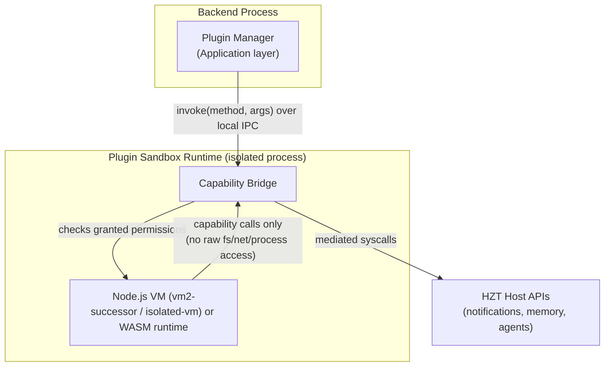
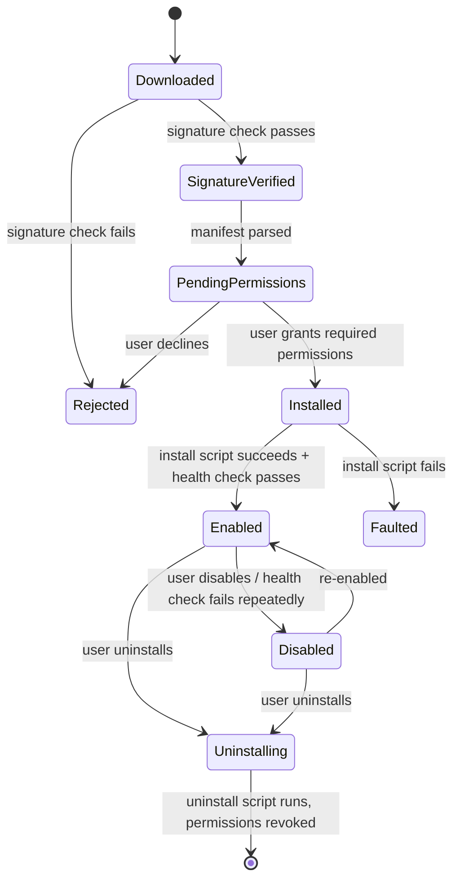

# 10 · Plugin System

## Purpose

Defines how HZT is extended without forking core code: the manifest format, permission model, sandbox
runtime, and lifecycle every plugin — first-party or third-party — goes through. This is what makes the
Marketplace ([docs/18-roadmap.md](18-roadmap.md#phase-3)) possible without turning every plugin install into a
security incident.

## Manifest

Every plugin ships a `manifest.json` validated against `plugins/manifest.schema.json`:

```json
{
  "id": "com.hermeszonetorba.plugins.discord",
  "name": "Discord Notifications",
  "version": "1.2.0",
  "hztApiVersion": "^1.0.0",
  "entryPoint": "dist/index.js",
  "runtime": "node-sandbox",
  "permissions": {
    "required": ["notifications.send", "network.egress:discord.com"],
    "optional": ["memory.read"]
  },
  "configSchema": "config.schema.json",
  "lifecycle": {
    "install": "scripts/install.js",
    "uninstall": "scripts/uninstall.js",
    "healthCheck": "scripts/health-check.js"
  },
  "dependencies": {
    "sdk": "@hzt/plugin-sdk@^1.0.0"
  },
  "signature": "base64-detached-signature"
}
```

| Field | Purpose |
|---|---|
| `id` | Reverse-DNS unique identifier, immutable across versions |
| `hztApiVersion` | SemVer range the plugin declares compatibility with — installs are rejected outside range |
| `runtime` | `node-sandbox` \| `wasm` (native/unsandboxed runtimes are not supported for third-party plugins) |
| `permissions.required` vs `optional` | Required permissions block install until granted; optional default to denied and can be granted later |
| `signature` | Detached signature over the packaged artifact — see [Trust model](#trust-model) |

## Permission model

Permissions are capability strings scoped by resource and action, e.g. `notifications.send`,
`memory.read`, `memory.write`, `network.egress:<host>`, `filesystem.read:<scope>`, `agents.terminal.execute`.
There is no "full access" permission — a plugin needing broad OS access (e.g., a Docker or IDE integration)
must enumerate the specific capabilities it needs, and the install flow shows the user exactly what's being
granted before `PluginInstallation` can reach `Enabled` (see the aggregate invariant in
[docs/03-domain-model.md](03-domain-model.md#plugins)).

## Sandbox runtime



Plugins never receive raw Node.js `fs`, `net`, `child_process`, or process handles — every host interaction
goes through the Capability Bridge, which checks the plugin's granted permission set on every call and denies
(with an auditable log entry) anything outside it. This is the same enforcement point regardless of whether
the plugin *tries* to exceed its declared permissions or a bug causes it to — the sandbox boundary, not
plugin-author trust, is what holds.

## Lifecycle



## Trust model

- **First-party plugins** (`plugins/examples/*` and marketplace-featured integrations) are signed with an HZT
  project key and reviewed through the same PR process as core code.
- **Third-party plugins** are signed by their author's key, registered against the author's Marketplace
  account; HZT verifies the signature matches the registered key before allowing install, and surfaces
  publisher identity + install count + permission list prominently — never silently.
- Marketplace submissions go through automated checks (manifest schema, permission-scope review, static scan
  for capability-bridge bypass attempts) plus manual review before "verified" status; unverified plugins can
  still be installed from a direct URL/file with an explicit extra warning step.

## Versioning & dependencies

Plugins declare a SemVer range against `hztApiVersion` and the `@hzt/plugin-sdk` version they were built
against (see [`sdk/typescript/`](../sdk/typescript/)). HZT keeps the last two major SDK versions supported so
plugin authors aren't forced into lockstep upgrades with every core release.

## Reference plugins

Example plugins for Discord, Slack, GitHub, GitLab, VS Code, JetBrains, Docker, Chrome/Firefox/Edge, Figma,
Notion, Jira, Linear, Obsidian, Spotify, and MCP servers are tracked as the Phase 3 Marketplace seed catalog
(see [docs/18-roadmap.md](18-roadmap.md)). [`plugins/examples/discord-plugin/`](../plugins/examples/discord-plugin/)
is the reference implementation new plugin authors should start from.

## Related documents

- [sdk/typescript/](../sdk/typescript/) — the SDK plugins are built against
- [docs/11-security.md](11-security.md) — sandbox isolation guarantees, secrets handling for plugin config
- [docs/03-domain-model.md](03-domain-model.md#plugins) — `PluginInstallation` aggregate and invariants
