# 12 · Database

## Purpose

The PostgreSQL schema backing the domain model in [docs/03-domain-model.md](03-domain-model.md), plus
indexing, partitioning, and caching strategy. Schema changes ship as EF Core migrations under
`backend/src/Infrastructure/HermesZoneTorba.Infrastructure/Persistence/Migrations/` — this document explains
the *shape*, migrations are the executable source of truth for exact DDL.

## Conventions

- Primary keys: `uuid` (v7, time-ordered — better index locality than v4 for high-insert tables like
  `metric_samples` and `audit_log`).
- Every table has `created_at timestamptz not null default now()`; mutable tables also have
  `updated_at timestamptz` maintained by an EF Core interceptor (not a DB trigger, to keep behavior in one
  place with the rest of the domain logic).
- Soft-delete (`deleted_at timestamptz null`) only on tables where recovery matters (e.g., `workflows`,
  `plugin_installations`); hard-delete elsewhere to avoid unbounded table growth for high-volume data.
- Foreign keys are always indexed explicitly — Postgres does not do this automatically.
- JSONB columns are used deliberately for genuinely schemaless data (`configuration`, `manifest`,
  `evidence`), never as an escape hatch around modeling a relationship properly.

## Core schema (ER diagram)

```mermaid
erDiagram
    USERS ||--o{ USER_ROLES : has
    ROLES ||--o{ USER_ROLES : "assigned via"
    ROLES ||--o{ ROLE_PERMISSIONS : grants
    PERMISSIONS ||--o{ ROLE_PERMISSIONS : "included in"

    HERMES_INSTANCES ||--o{ INCIDENTS : "subject of"
    HERMES_INSTANCES ||--o{ HERMES_CONFIGURATIONS : "versioned by"

    MODEL_REGISTRY ||--o{ OLLAMA_MODELS : "cataloged as"
    OLLAMA_MODELS ||--o{ MODEL_BENCHMARKS : "benchmarked as"

    INCIDENTS ||--o{ INCIDENT_EVENTS : "timeline of"
    HEALING_POLICIES ||--o{ INCIDENT_EVENTS : "applied via"

    WORKFLOWS ||--o{ WORKFLOW_TRIGGERS : has
    WORKFLOWS ||--o{ WORKFLOW_EXECUTIONS : "run as"
    WORKFLOW_EXECUTIONS ||--o{ WORKFLOW_STEP_RESULTS : contains

    PLUGIN_INSTALLATIONS ||--o{ PLUGIN_PERMISSION_GRANTS : "granted"

    USERS ||--o{ AUDIT_LOG : "acts in"
    USERS ||--o{ MEMORY_ENTRIES : owns
    MEMORY_ENTRIES ||--o{ MEMORY_ENTRY_LINKS : "linked via"

    USERS {
        uuid id PK
        text email UK
        text password_hash
        boolean mfa_enabled
        timestamptz created_at
    }
    ROLES {
        uuid id PK
        text name UK
        boolean is_builtin
    }
    HERMES_INSTANCES {
        uuid id PK
        text version
        text status
        uuid active_configuration_id FK
        text install_path
        timestamptz installed_at
        timestamptz last_health_check_at
    }
    OLLAMA_MODELS {
        uuid id PK
        uuid registry_entry_id FK
        text provider
        text status
        bigint disk_bytes
        timestamptz pulled_at
    }
    INCIDENTS {
        uuid id PK
        uuid aggregate_id
        text aggregate_type
        text fault_type
        text status
        jsonb evidence
        timestamptz occurred_at
        timestamptz resolved_at
    }
    WORKFLOWS {
        uuid id PK
        text name
        boolean enabled
        jsonb definition
        int version
        timestamptz deleted_at
    }
    PLUGIN_INSTALLATIONS {
        uuid id PK
        text plugin_id
        text version
        text status
        jsonb manifest
        timestamptz deleted_at
    }
    AUDIT_LOG {
        uuid id PK
        uuid actor_user_id FK
        text action
        text target_type
        uuid target_id
        text result
        text trace_id
        timestamptz occurred_at
    }
    MEMORY_ENTRIES {
        uuid id PK
        uuid owner_user_id FK
        text content
        uuid vector_ref
        jsonb metadata
        timestamptz created_at
    }
```

## Table groups & key indexes

| Group | Tables | Notable indexes |
|---|---|---|
| Identity & Access | `users`, `roles`, `permissions`, `user_roles`, `role_permissions` | Unique `(email)`, unique `(role_id, permission_id)` |
| Hermes Management | `hermes_instances`, `hermes_configurations` | `(status)` partial index for active-instance queries |
| Model Management | `model_registry`, `ollama_models`, `model_benchmarks`, `provider_configurations` | `(provider, status)`, GIN index on `model_registry.tags` |
| Supervision | `incidents`, `incident_events`, `healing_policies` | `(aggregate_id, status)`, `(occurred_at)` for timeline queries |
| Automation | `workflows`, `workflow_triggers`, `workflow_executions`, `workflow_step_results` | `(workflow_id, started_at)`, GIN index on `workflows.definition` for trigger-type lookup |
| Plugins | `plugin_installations`, `plugin_permission_grants` | Unique `(plugin_id, version)` |
| Security | `audit_log` | `(actor_user_id, occurred_at)`, `(target_type, target_id)` — see [partitioning](#partitioning) |
| Memory | `memory_entries`, `memory_entry_links` | `(owner_user_id, created_at)`; vector similarity lives in Qdrant, `vector_ref` is the join key |
| Observability | `metric_samples` (rollup) | Partitioned, see below |

## Partitioning

`audit_log` and `metric_samples` are high-write, time-ordered, and queried almost exclusively by recent range
— both are **range-partitioned by month** on their timestamp column via native PostgreSQL declarative
partitioning, with a scheduled job (see [docs/13-workflows.md](13-workflows.md#scheduler)) creating the next
partition ahead of time and dropping/archiving partitions past the retention window
(`AuditRetentionMonths`, `MetricRetentionDays` config). This keeps index size and vacuum cost bounded as the
system runs for years, not just through a demo.

## Caching strategy

| Cached data | Store | TTL / invalidation |
|---|---|---|
| Current user permission set | Redis | Invalidated on role/permission change (published as a domain event) |
| Provider health status | Redis | 5–15s TTL, refreshed by the health-check loop |
| Live metric ring buffer | In-process + Redis (for multi-instance fan-out) | 5-minute rolling window, not persisted as-is |
| Model Registry catalog | Redis, warmed on startup | Invalidated on catalog refresh job completion |
| SignalR group membership / backplane | Redis | Managed by the SignalR Redis backplane provider |

Everything cached in Redis is a derived/read-optimized view of PostgreSQL data — Postgres remains the system
of record; Redis is never the only copy of anything that matters.

## Migrations

Standard EF Core migrations (`dotnet ef migrations add <Name>`), one migration per logical schema change,
reviewed like any other code change. CI runs `dotnet ef database update` against a throwaway database as part
of integration tests (see [docs/16-testing.md](16-testing.md)) to catch migrations that don't apply cleanly
before merge. Destructive migrations (column/table drops) require an explicit backward-compatible rollout
plan documented in the PR description — see [docs/17-deployment.md](17-deployment.md#zero-downtime-migrations).

## Related documents

- [docs/03-domain-model.md](03-domain-model.md) — the aggregates these tables persist
- [docs/17-deployment.md](17-deployment.md) — migration rollout strategy in production
