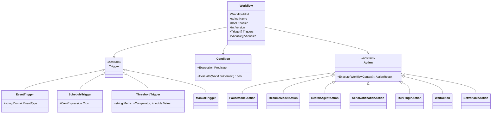
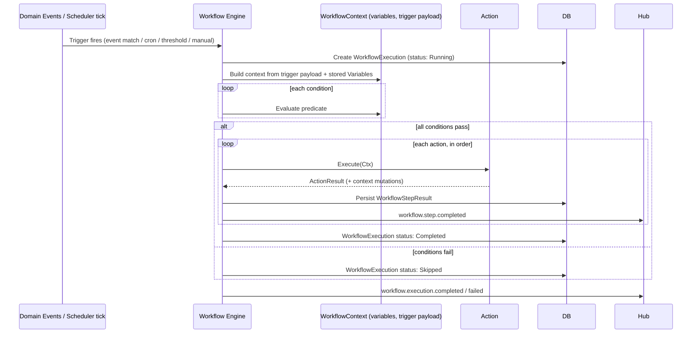

# 13 · Automation & Workflows

## Purpose

The Automation Engine, the Scheduler, and the Memory Engine's role in workflows — the layer that turns "IF
GPU usage > 95%, pause LLM, wait, resume" from a feature request into a concrete, versioned, auditable
`Workflow` aggregate (see [docs/03-domain-model.md](03-domain-model.md#automation)).

## Model: triggers, conditions, actions



**Example — the brief's canonical case, expressed as the stored `definition` JSONB:**

```json
{
  "trigger": { "type": "threshold", "metric": "gpu.utilization", "comparator": ">", "value": 95, "sustainedForSeconds": 10 },
  "conditions": [],
  "actions": [
    { "type": "pauseModel", "target": "active" },
    { "type": "wait", "durationSeconds": 60, "untilConditionClears": true },
    { "type": "resumeModel", "target": "active" }
  ]
}
```

Battery and disk examples from the brief ("IF Battery < 20%, Stop Models, Enable Power Saving"; "IF Disk Full,
Cleanup, Notify User") follow the identical shape — this is deliberate: there is exactly one execution engine
for both user-authored automation and the seeded policies described in
[docs/09-auto-healing.md](09-auto-healing.md#built-in-policies-seed-data). Auto-Healing policies are simply
workflows scoped to system-owned triggers with a stricter approval ceiling; they are not a separate execution
path to maintain.

## Execution



A failed action halts the remaining chain by default (configurable per-action as `continueOnFailure`) and the
execution is marked `Failed` with the failing step and error captured — surfaced in the Workflow Builder's
execution history so authors can debug without grepping logs.

## Scheduler

Backs `ScheduleTrigger` and general recurring/background jobs (maintenance, cleanup, model-catalog refresh,
metric partition rollover — see [docs/12-database.md](12-database.md#partitioning)). Built on a Postgres-
backed job table (not an in-memory-only scheduler) so scheduled jobs survive restarts, plus distributed locks
via Redis so a horizontally scaled API doesn't run the same cron job twice.

| Job class | Examples |
|---|---|
| Cron / recurring | User-defined `ScheduleTrigger` workflows |
| Daily / weekly maintenance | Model catalog refresh, metric rollup, audit log partition creation |
| Delayed jobs | `WaitAction` resumption, deferred notifications |
| Cleanup jobs | Expired idempotency keys, orphaned temp files, stale plugin sandbox processes |

## Visual Workflow Builder

The dashboard's drag-and-drop builder (`frontend/app/(dashboard)/workflow-builder/`) edits the same
`definition` JSON shown above through a node-graph UI — trigger node, condition nodes, action nodes, connected
by edges that map 1:1 to the `Trigger → Condition[] → Action[]` structure. The builder never introduces a
parallel representation that has to be reconciled with the engine's model; what you drag is what executes.

## Templates & variables

Workflows support named `Variable`s scoped to the execution (seeded from trigger payload, mutable via
`SetVariableAction`) and can be saved as reusable **templates** in the Workflow Marketplace — a template is a
`Workflow.definition` with variable placeholders (`{{modelName}}`) resolved at instantiation time, distinct
from a live `Workflow`, so installing a template never silently activates automation without the user
reviewing and enabling it.

## Memory & RAG

Workflows can read (`memory.search`, semantic) and write (`memory.write`) `MemoryEntry` aggregates as actions,
giving automations context ("if this error pattern looks like one we've seen before, attach the prior
resolution") without every workflow author re-implementing retrieval — the RAG pipeline itself
(embedding → vector search → context assembly) is documented in
[docs/07-local-llm.md](07-local-llm.md#rag--vector-memory-integration).

## Related documents

- [docs/09-auto-healing.md](09-auto-healing.md) — the system-owned workflows built on this same engine
- [docs/03-domain-model.md](03-domain-model.md#automation) — the `Workflow` aggregate and its invariants
- [docs/08-os-monitor.md](08-os-monitor.md) — the metric events `ThresholdTrigger` subscribes to
