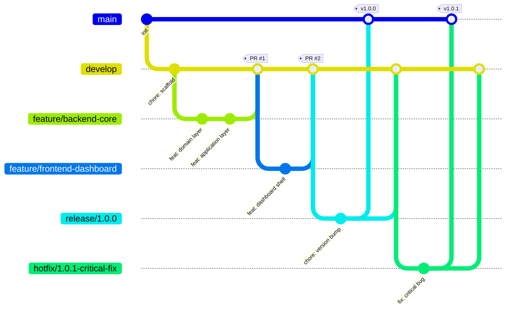

# 14 · Branching Strategy

## Purpose

The Git workflow every contributor follows. This is the detailed reference; [CONTRIBUTING.md](../CONTRIBUTING.md)
is the quick-start version pointing back here.

## Branch model

| Branch | Purpose | Protected | Merges into |
|---|---|---|---|
| `main` | Always releasable; every commit is a tagged release | Yes — no direct pushes, PR + CI + review required | — |
| `develop` | Integration branch for the next release | Yes — PR + CI required, review recommended | `main` (via `release/*`) |
| `feature/<area>-<desc>` | New functionality, e.g. `feature/backend-core`, `feature/frontend-dashboard`, `feature/desktop-agent` | No | `develop` |
| `fix/<area>-<desc>` | Non-urgent bug fixes | No | `develop` |
| `release/<version>` | Stabilization branch cut from `develop` before a release | Yes | `main` and back into `develop` |
| `hotfix/<version>-<desc>` | Emergency fix cut from `main` | Yes | `main` and back into `develop` |

## Branch protection rules

**`main`:**
- Require pull request before merging, ≥1 approval, dismiss stale approvals on new commits.
- Require status checks to pass: `backend-ci`, `frontend-ci`, `desktop-ci` (when applicable paths changed).
- Require branches to be up to date before merging.
- Require signed commits.
- No force pushes, no deletions.
- Restrict who can push directly: nobody (PR-only, enforced even for admins).

**`develop`:**
- Same as `main` minus signed-commit requirement (recommended, not enforced) to keep contributor friction low.
- Linear history preferred (squash merge default) to keep `git log` on `develop` readable.

## Standard flow

1. Branch from `develop`: `git checkout -b feature/backend-hermes-installer develop`.
2. Commit using [Conventional Commits](https://www.conventionalcommits.org/) (see [CONTRIBUTING.md](../CONTRIBUTING.md#commit-messages)).
3. Push, open a PR targeting `develop` using the [PR template](../.github/PULL_REQUEST_TEMPLATE.md).
4. CI runs automatically (path-filtered — only the affected `backend-ci`/`frontend-ci`/`desktop-ci` workflow
   triggers, see [.github/workflows/](../.github/workflows/)).
5. Address review feedback; once approved and green, squash-merge into `develop`.
6. Delete the feature branch.

## Release flow

1. Maintainer cuts `release/<version>` from `develop` when `develop` is feature-complete for that version.
2. Only fixes and release-prep commits (changelog, version bump) land on the release branch.
3. On release readiness, `release/<version>` merges into `main` (triggers [.github/workflows/release.yml](../.github/workflows/release.yml)
   — semantic-release tags the version, builds and publishes Docker images and desktop installers) and back
   into `develop` so the release-branch fixes aren't lost.

## Hotfix flow

Cut directly from `main` for production-breaking bugs that can't wait for the next release cycle; same
merge-back-to-both rule applies. Hotfixes get the same CI and review bar as any other change to `main` — "it's
urgent" changes the timeline, not the quality gate.

## Related documents

- [CONTRIBUTING.md](../CONTRIBUTING.md) — day-to-day contributor checklist
- [docs/17-deployment.md](17-deployment.md#release-strategy) — what happens after `main` receives a release merge
- [docs/16-testing.md](16-testing.md) — what CI actually runs at each gate
