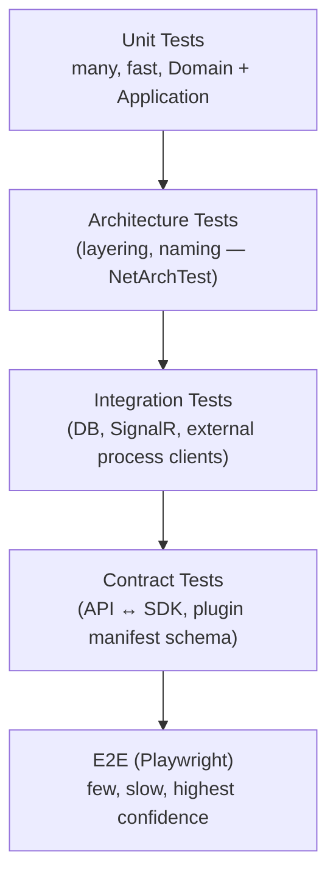

# 16 · Testing Strategy

## Purpose

What gets tested, at what level, with what tooling, and what CI blocks a merge on. Cross-referenced from
[CONTRIBUTING.md](../CONTRIBUTING.md#testing-expectations) — this is the detail behind that checklist.

## Test pyramid

More tests at the bottom, fewer and higher-confidence at the top — standard shape, applied specifically to
where HZT's risk actually lives (domain invariants, layering, provider contracts, agent lifecycle flows).

## Backend

| Tier | Location | Tooling | What it covers |
|---|---|---|---|
| Unit | `HermesZoneTorba.Domain.UnitTests`, `HermesZoneTorba.Application.UnitTests` | xUnit, FluentAssertions, NSubstitute | Aggregate invariants, command/query handler logic (Infrastructure mocked via Application interfaces) |
| Architecture | `HermesZoneTorba.Architecture.Tests` | NetArchTest | Layering rules, naming conventions — see [docs/15-coding-standards.md](15-coding-standards.md#dependency-rules) |
| Integration | `HermesZoneTorba.Infrastructure.IntegrationTests` | xUnit + Testcontainers (Postgres, Redis) | EF Core mappings/migrations, real repository behavior, provider HTTP clients against recorded/mocked endpoints |
| API Integration | `HermesZoneTorba.Api.IntegrationTests` | `WebApplicationFactory`, Testcontainers | Full request pipeline: auth, validation, Problem Details mapping, SignalR hub round-trips |
| Contract | `tests/contract/` | Pact-style or schema-diff against `shared/contracts/` | OpenAPI/AsyncAPI backward compatibility, plugin `manifest.schema.json` conformance |
| Performance/Load | `tests/load/` | k6 or NBomber | API throughput under concurrent agent supervision load, SignalR fan-out at scale |
| Security | CI-integrated | `dotnet list package --vulnerable`, CodeQL, dependency review | Known-vulnerable packages, common vuln patterns — see [docs/11-security.md](11-security.md) |

Every command/query handler ships with at least one "happy path" unit test and one test per validated
failure mode (invariant violation, not-found, unauthorized). Aggregates are tested directly against their
public methods — no reflection-based "test the private state" shortcuts.

## Frontend

| Tier | Tooling | What it covers |
|---|---|---|
| Unit | Vitest + React Testing Library | Hooks (`lib/hooks/*`), pure utility functions, Zustand store logic |
| Component | React Testing Library | Interactive components — forms, dashboard cards, workflow builder nodes |
| E2E | Playwright (`.github/workflows/frontend-ci.yml`, `e2e` job) | Critical user journeys: install flow, model download, workflow creation, incident approval |

Components that fetch data are tested with a mocked API layer (MSW) so component tests don't depend on a live
backend; the E2E suite is what actually exercises the real API against a Dockerized backend.

## Desktop

Rust unit tests (`cargo test`) for the daemon/native modules, plus a debug Tauri build in CI
(`.github/workflows/desktop-ci.yml`) as a build-integrity check across Windows/Linux/macOS. Full native OS
integration (tray, notifications) is verified manually per release against a documented smoke-test checklist
in [docs/17-deployment.md](17-deployment.md#release-checklist) — these are inherently hard to fully automate
cross-platform and the project is explicit about that gap rather than pretending otherwise.

## Stress & chaos testing

Because the Auto-Healing Engine's entire job is reacting to failure, its test suite deliberately injects
failure: kill a supervised process mid-task, fill a test volume to trigger disk-cleanup policies, simulate a
provider timeout. These live in `HermesZoneTorba.Infrastructure.IntegrationTests` under a
`Category=Chaos` filter, run in CI on a schedule (nightly) rather than on every PR, since they're slower and
noisier than the standard suite.

## CI gating

| Branch/PR target | Required checks |
|---|---|
| PR → `develop` | Unit, Architecture, Integration, Frontend unit/lint/build, Desktop debug build (path-filtered) |
| PR → `main` (via `release/*`) | All of the above + E2E + Contract + security scan |
| Nightly (schedule) | Full suite including Chaos and Load tests |

## Related documents

- [docs/15-coding-standards.md](15-coding-standards.md) — the rules architecture tests enforce
- [.github/workflows/](../.github/workflows/) — the executable version of this document
- [docs/17-deployment.md](17-deployment.md) — release checklist and manual verification steps
