# 18 · Roadmap

## Purpose

The phased plan from "architecture on paper" to "enterprise-ready platform," and the current phase (so
contributors know what's in scope right now vs. deliberately deferred). Scope changes to a phase go through
an ADR, not an ad-hoc PR description.

```mermaid
gantt
    title HZT Roadmap (indicative, not date-committed)
    dateFormat X
    axisFormat %s
    section Phase 0
    Research & Architecture        :done, p0, 0, 1
    section Phase 1
    Project Skeleton & Auth        :active, p1a, 1, 2
    Dashboard + Hermes/Ollama Mgrs :p1b, after p1a, 2
    OS Monitoring                  :p1c, after p1a, 2
    section Phase 2
    Automation + AI Supervisor     :p2a, after p1b, 2
    Plugin SDK + Desktop           :p2b, after p1c, 2
    section Phase 3
    Marketplace + Memory Engine    :p3a, after p2a, 2
    Workflow Builder + Multi-Agent :p3b, after p2b, 2
    section Phase 4
    Enterprise + Cloud Sync + HA   :p4, after p3a, 3
```

## Phase 0 — Research, Architecture, Planning, Documentation *(current)*

**Status: in progress.** This repository's current state — the domain model, API contracts, module
boundaries, and the docs set under `docs/` — is the Phase 0 deliverable. Exit criteria:

- [x] System architecture, domain model, and folder structure documented and reviewed
- [x] Backend/frontend/desktop skeletons compile and demonstrate the intended patterns end-to-end for one
      vertical slice (Hermes install flow)
- [ ] Team alignment on ADRs 0001–0005 (see [docs/adr/](adr/))
- [ ] CI green on all three pipelines against the skeleton

## Phase 1 — Project Skeleton, Auth, Dashboard, Core Managers

- Full authentication (JWT + refresh, RBAC) wired end-to-end, not just documented
- Dashboard shell with real navigation, Overview page backed by live data
- **Hermes Manager**: install/update/configure/repair/restart/stop, fully implemented per
  [docs/06-hermes-integration.md](06-hermes-integration.md)
- **Ollama Manager / Model Registry**: download/delete/switch/benchmark, per
  [docs/07-local-llm.md](07-local-llm.md)
- **OS Monitoring**: CPU/RAM/GPU/Disk live on the dashboard, per [docs/08-os-monitor.md](08-os-monitor.md)

## Phase 2 — Automation, AI Supervisor, Plugin SDK, Desktop Integration

- AI Supervisor detecting and classifying faults ([docs/05-ai-supervisor.md](05-ai-supervisor.md)); Auto-
  Healing executing the built-in policy set ([docs/09-auto-healing.md](09-auto-healing.md))
- Automation Engine + Scheduler, triggers/conditions/actions runnable from the dashboard
  ([docs/13-workflows.md](13-workflows.md))
- Plugin SDK v1 published, sandbox runtime hardened, first-party reference plugin shipped
  ([docs/10-plugin-system.md](10-plugin-system.md))
- Desktop shell: tray, notifications, background daemon, auto-update

## Phase 3 — Marketplace, Memory Engine, Workflow Builder, Multi-Agent Collaboration

- Plugin & Prompt & Workflow Marketplace, with the trust/review pipeline from
  [docs/10-plugin-system.md](10-plugin-system.md#trust-model)
- Memory Engine: vector memory, knowledge graph, RAG surfaced in the dashboard and available to workflows
- Visual drag-and-drop Workflow Builder (frontend), 1:1 with the engine's execution model
- Multi-agent collaboration roles (Planner, Researcher, Coder, Architect, Reviewer, Debugger, Tester, Document
  Writer) coordinating via `core/protocol`-defined structured messages, supervised individually and as a
  correlated `WorkflowExecution` per [docs/05-ai-supervisor.md](05-ai-supervisor.md#multi-agent-awareness)
- Voice assistant ("Hey Hermes"), screen understanding/OCR, vision model integration

## Phase 4 — Enterprise Features

- Cloud sync and remote device management for multi-machine setups
- Fleet/cluster management (many HZT instances under central policy — the ABAC groundwork from
  [docs/11-security.md](11-security.md) extends here)
- Kubernetes-native deployment hardened for HA, per [docs/17-deployment.md](17-deployment.md#kubernetes-enterprise-phase-4)
- Advanced observability: SLOs, alerting integrations, compliance-grade audit export

## Non-goals, revisited per phase

[docs/00-project-vision.md](00-project-vision.md#non-goals-for-now) lists what's explicitly out of scope for
Phase 0–2. Phase 3–4 reopen some of that (fleet management, for instance) deliberately — this roadmap is the
place that tracks when a "not now" becomes "now."

## Related documents

- [docs/adr/](adr/) — decisions made along the way, with the trade-offs considered
- [ARCHITECTURE.md](../ARCHITECTURE.md) — the architecture this roadmap is built toward, not something later
  phases are expected to redesign wholesale
